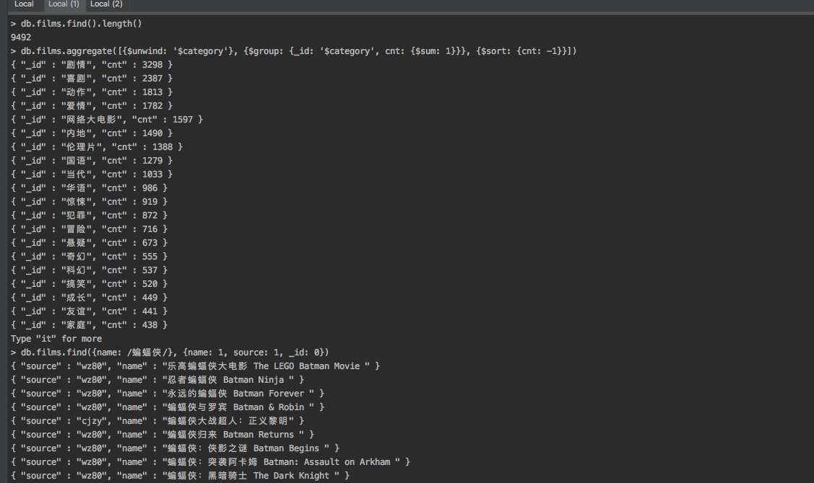

# vp

用于练手 Scrapy & Vue & Flask 的一个小应用

可以在手机上看电影的小站点。

后端采用 Scrapy 爬一些资源采集网站
前端计划 Vue 撸一个小 WebUI
使用 Flask 提供 RESTful API

# 说明

 - [x] 数据采集部分
 - [x] WebUI   <--- By Vuetify & Vue CLI3
 - [x] ~~RESTful~~ API <---- By flask

# Step 1. 搜集站点

寻找可以采集视频网站的站点: [资源采集](https://www.google.com/search?q=%E8%B5%84%E6%BA%90%E9%87%87%E9%9B%86&oq=%E8%B5%84%E6%BA%90%E9%87%87%E9%9B%86+&aqs=chrome..69i57j69i61l3.5331j0j1&sourceid=chrome&ie=UTF-8)
获取到以下站点:


- https://www.yongjiuzy.com
- http://www.131zyw.com/
- http://www.caijizy.com/
- http://www.wz80.com/

# Step 2. 撰写代码

撰写爬虫,  `scrapy startproject vp`

根据 Scrapy 的文档，可以使用 [Scrapy.Item](http://doc.scrapy.org/en/latest/topics/items.html) 来存储爬去下来的文档，对于一部简单的电影通常包括如下属性:

``` python
class FilmItem(scrapy.Item):
    source = scrapy.Field()  # 电影来源
    name = scrapy.Field()  # 电影名字
    name_alias = scrapy.Field()  # 电影别名
    note = scrapy.Field()  # 备注
    category = scrapy.Field()  # 电影类型
    region = scrapy.Field()  # 地区
    cover = scrapy.Field()  # 封面图
    poster = scrapy.Field()  # 播放时需用第一帧图.
    url = scrapy.Field()   # 播放地址
    actors = scrapy.Field()  # 领衔主演
    director = scrapy.Field()  # 导演
    synopsis = scrapy.Field()  # 简介
    language = scrapy.Field()  # 语言
    year = scrapy.Field()  # 上映年份
```

由于我们要采集不同网站，所以需要多个不同的 Spider， 观察不同的站点并且抽取出公共的部分作为所有 Spider 的基类，参见 `misc.spider.CommonSpider`

# Step3. 存储

本业务需求不涉及 URL 的去重，应该可以将参数 dont_filter 设置为 True 同时也无需引入 scrapy-redis 这种用于分布式爬虫的插件，不同站点的电影需要考虑去重，
本文使用 Mongo 进行数据存储，根本原因在于 mongo 存储和查询的时候都超级简单，例子可以看后门的效果一栏。

将电影名设置为唯一属性，存在则更新，不存在则插入。目前已经实现的功能 [Scrapy-Mongo](https://github.com/sebdah/scrapy-mongodb)
配置如下：

```Python
{
    'vp.pipelines.FilmPipeline': 300,
    'scrapy_mongodb.MongoDBPipeline': 500, # 存入Mongo 之中
}


MONGODB_UNIQUE_KEY = 'name' # 电影名唯一
MONGODB_DATABASE = 'vp'
MONGODB_COLLECTION = 'films'
MONGODB_ADD_TIMESTAMP = True
```

考虑到存入 Mongo 之前需有清理、 验证等过程，因此还需要引入 [ItemPipe](https://doc.scrapy.org/en/latest/topics/item-pipeline.html)
如前文提到的 ` 'vp.pipelines.FilmPipeline`, `scrapy_mongodb.MongoDBPipeline`, 其配置等数字代表处理的优先级（先后顺序）


# Step 4. 调试

参见 [Scrapy shell](https://doc.scrapy.org/en/latest/topics/shell.html)
比如指定爬虫爬取某一页URL并且指定方法进行处理:
`python -m scrapy parse --spider=cjzy "http://www.caijizy.com/?m=vod-detail-id-12738.html" -c parse_film_detail`

# Step 5. 效果

```shell

> db.films.find().length()  # 查看电影总数
9492
> db.films.aggregate([{$unwind: '$category'}, {$group: {_id: '$category', cnt: {$sum: 1}}}, {$sort: {cnt: -1}}]) # 统计各类型电影数量
{ "_id" : "剧情", "cnt" : 3298 }
{ "_id" : "喜剧", "cnt" : 2387 }
{ "_id" : "动作", "cnt" : 1813 }
{ "_id" : "爱情", "cnt" : 1782 }
{ "_id" : "网络大电影", "cnt" : 1597 }
{ "_id" : "内地", "cnt" : 1490 }
{ "_id" : "伦理片", "cnt" : 1388 }
{ "_id" : "国语", "cnt" : 1279 }
> db.films.find({actors: {$all: [/刘德华/, /周润发/]}}, {name: 1, actors: 1, _id: 0}) # 寻找 刘德华 和 周润发 合作的电影.
{ "name" : "精装追女仔3之狼之一族 ", "actors" : [ "刘德华", "张敏", "邱淑贞", "冯淬帆", "王晶", "黄霑", "周慧敏", "吴君如", "周润发", "郑丹瑞" ] }
{ "name" : "江湖情 ", "actors" : [ "周润发", "刘德华", "谭咏麟", "刘嘉玲", "万梓良", "李修贤", "王小凤" ] }
{ "name" : "江湖情2英雄好汉 英雄好漢 ", "actors" : [ "周润发", "刘德华", "万梓良", "刘嘉玲", "李修贤", "杨群", "柯俊雄", "王小凤", "成奎安" ] }

```

**截图**



# 其他

简单跑了一下，发现以上网站都不需要使用Proxy就能直接爬完 也是惊讶....
